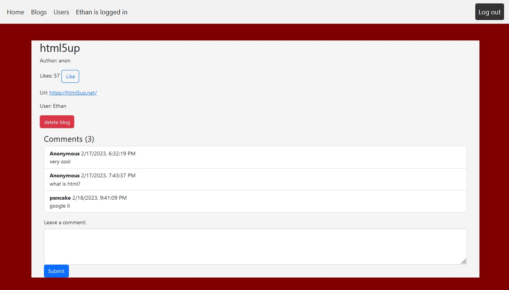

# Blog List App

This is a web application that displays a list of blog posts sorted by the number of likes. To access the app, users must first register and then log in with their chosen username and password. The app is built using React and React Router, and utilizes React Bootstrap for styling.

## Demo

You can access the live demo [here](https://busy-gray-jackrabbit-fez.cyclic.app/).

## Features

- Displays a list of blog posts sorted by the number of likes.
- Clicking on a post takes you to a detailed view of the post.
- Registration and login required to access the app.
- Built using React and React Router.
- Utilizes React Bootstrap for styling.

## Installation and Usage

1. Clone the repository.
2. Install the necessary dependencies with `npm install`.
3. Start the application with `npm start`.
4. Access the application in your web browser at `http://localhost:3000`.

## Contributing

If you would like to contribute to this project, please feel free to open a pull request. Any contributions are greatly appreciated.

## License

This project is licensed under the [MIT License](https://opensource.org/licenses/MIT).